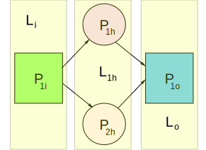

# Machine Learning with Neural Networks

## Perceptrons

The basic unit of work in a neural network is the `perceptron`. A `perceptron` has an associated potential to emit a signal. For convenience the value of the potential is kept between  and . If the potential  the neuron is active, if  the neuron is inactive. We can implement the `perceptron` as a function  with an array of `activation values`  i.e.   in it's internal scope. The function parameters are an array of `weight values`  or . The output then is the signal . The values  and  are defined as tensors because the types of operations or functions that will be used to manipulate the `perceptrons` comes from a branch of mathematics called [Tensor Analysis](https://en.wikipedia.org/wiki/Tensor_calculus). Consider the implementation of  based on the following:

* We define tensors  and .
* Multiply tensors  and  i.e. .
* The tensor product will be .
* Reduce  to a scalar value by adding it's components.
* The sum of the  components is .
*  is called a weighted sum  and is represented by  where  is the number of elements in .
*  determines the strength of the signal emitted by the `perceptron`.
* Capping  adds additional control over signal emission and is done by subtracting a bias  from the sum.
* It is possible for  to have a value outside the desire signal strength . For this reason an `activation function` is used to bring  into the desired range.
* One of the  commonly used `activation functions` is the `sigmoid` .

In conclusion the implementation of a perceptron is the function .

## Neural Networks

A `neural network` is a graph of associated `perceptrons`. `Neural networks` are composed of `neural network layers`. A `neural network layer` is a tensor of `perceptrons`. The `perceptrons` in a `neural network layer` are connected to each other because they are components of a tensor. We can define layer n as . Neural networks have three `layer types input, hidden, and output`. A neural network  may have multiple hidden layers but only one input and output layers. Consider a neural network consisting of the fallowing layers:

 &nbsp;&nbsp;  &nbsp;&nbsp; 

Neural network themselves are tensors. In this case neural network . `Perceptrons` in a neural network are associated to each other via `function composition`. Consider  it has an internal tensor of `activation values` . The number of components in  is one. The output of  is a potential . The key question one must ask at this point is, how are the number of `activation values` in  associated to the number of `activation values` in ? Here is where the magic happens  becomes the input weight for  and . This means that  becomes  a weight value tensor and the input for  and . This means that the activation values tensor for  is  a tensor with one component because the input layer consist of only one component . Is important to notice that `the number of activation values in a layer's perceptrons are determined by the number of perceptrons in the previous layer`.

For completeness let's consider the output layer `perceptron` . Based on our current understanding  has an internal tensor of `activation values`  because  has two components  and . The output for  is a potential  and the output for  is a potential  therefore the weight value tensor is . The weighted sum for  is  and its potential is . Notice how all perceptrons in every layer of the neural network are relaying information i.e. emitting a signal directly or indirectly to each other in a forward direction. The type of neural network where all perceptrons are connected to each other is called a dense neural network.

## Neural Networks In Action

### Introduction

We define a `neural network algorithm` as a function  that produces an `output`  in response to an `input`  and n number of hidden layers  i.e. . A neural network is a system defined by the following tensor .
In our daily experience we go through time and we have a `state` at each moment in time. Our reality is a series of moments in time. At each moment we can `assess our state` and map any number of metrics to an exact moment in time and persist the resulting information representing our `state`. Our memories are our `state` and we derive knowledge from them. Compare to you or me  is a very simple system, a moment of time for  is represented by evaluating  and  at a given value of . We bring  to life by feeding it `input` and evaluating the `output` of every `perceptron`  in each neural network layer . 

### Back Propagation Training Using The Gradient Descent Algorithm
 
Back propagation is the most widely used machine learning algorithm. The algorithm's objective is to find the optimal values for  that will yield expected outputs  in  through a training process. The algorithm's steps are:

1. Identify the unique set of elements in a training set representing the expected labeled output call it .
2. Generate an initial set of random numbers corresponding to the number of perceptrons in  in the range  and use them to construct  the tensor used to invoke  for every perceptron in .
3. Set  for all perceptrons in  and  in all perceptrons in  to random numbers in the range . 
4. Iterate over the input data set.
5. At the beginning of each iteration generate  for each perceptron in  based on the current input element.
6. Compute  to invoke  for each perceptron in all layers. The output of perceptrons in a previous layer became the input  for the current layer.
7. At the end of each iteration compute the error between the current output  and the expected output . One of the most commonly used error, cost, or loss functions to compare  vs.  is the [Mean Squared Error](https://en.wikipedia.org/wiki/Mean_squared_error) function . The error indicates how close the  is to .
8. Compute the rate of change of the error function. The rate of change of a single variable function with one scalar output is called a derivative i.e. . The rate of change of a multi variable function with one scalar output is called the `gradient` i.e .  The `gradient` indicates the direction and factor of magnitude of greatest increase of the error function. In this case the  needs to be computed since we are dealing with multi variable tensors.
9. This step requires  to be negative because the objective is to advance towards lower error or cost i.e. . Define `learning rate`  a number , used as a factor that determines the magnitude of  in conjunction with . Define `momentum`  a number between , used as a factor that determines the magnitude of  in conjunction with . The magnitude of  will determine how big of a step we take in our search to minimize the error or cost . The magnitude of  will determine how much of an influence the previous values of  have in our search to minimize the error or cost . Compute the scalar values  by which  needs change in order to decrease error i.e. bring  closer . To fine tune the bias add  to it.
10. Calculate  in the backward direction to adjust every  in  across all layers in  relative to it's adjacent layer. This step is know as `back propagation`.
11. After iterating over the complete training data set verify that the current error is less or equal to the `error threshold`  or that the `maximum number of iterations`  was reached, if true stop training else continue. Each complete iteration over all items in a training set is called an `epoch`.

Is crucial to understand that  and associated bias change as a result of back propagation while  changes as a result of iterating over training data in the forward direction. This means that properly labeled data is essential  for training and how well  performs. When practicing machine learning you will be presented with the opportunity to adjust what are called hyper parameters some of them are:

*  error threshold.
*  expected number of iterations.
*  learning rate.
*  momentum.

## Training Data

The process of preparing training data sets is challenging. The key to the process is proper vectorization and labeling of training data. Neural networks can be applied to all kind of problems involving regression, classification, or prediction. The way data is prepared for training requires careful consideration of the domain and the goals one intents to achieve.

Imagine we have a set of data representing the horse power , and the miles per gallon  of a model . The array  represents an element in our raw dataset. Our objective is to determine if there is a relationship between  and  and to design a neural network  that will help us predict the  given . To prepare the data for consumption we need understand what are the inputs and outputs for our model. Since our intent is to predict  in relationship to  regardless of the model, then our training data becomes . The last step in the process is data normalization, and is usually accomplished by [min-max feature scaling](https://en.wikipedia.org/wiki/Feature_scaling). The function for `min-max feature scaling` is  where  is any value,  is the maximum, and  is the minimum in the array . Normalization assures that the value  is always within the range . In our case study  and the expected output . Normalization is necessary because it brings any data set to the necessary range .

## Conclusion

Neural networks are a way to universally model functions. When a neural network is trained it becomes a function specific to the training domain. After training the acquired knowledge can be preserved by serializing , associated biases, and all the hyper parameters used during training. When utilizing the neural network for regression, predictions, or classification the activation values come form the input provided and the wights are not changed. The activation values flow forward from the input layer to the output layer. The resulting kernel of knowledge is very tiny in comparison to the training data and could be used almost anywhere including a web browser. Is as simple as using your AI framework of choice to instantiate  by deserializing  and giving it an input, then you get your lovely output like magic. 

## Examples

In the [examples](https://github.com/geosp/hello_brain/tree/master/src/examples) directory you can find several examples using the [Brain.JS](https://brain.js.org) framework to create and train neural networks.

## References

1. [Neural Networks and Deep Learning](http://neuralnetworksanddeeplearning.com)
2. [How Deep Neural Networks Work by Brandon Rohrer](https://end-to-end-machine-learning.teachable.com/p/how-deep-neural-networks-work)
3. [Neural Networks Deep Dive](https://www.youtube.com/playlist?list=PLZHQObOWTQDNU6R1_67000Dx_ZCJB-3pi)
4. [Scrimba tutorial by Robert Plummer creator of Brain.JS](https://scrimba.com/g/gneuralnetworks) 
5. [Lodash](https://lodash.com/docs)
6. [Lodash FP](https://github.com/lodash/lodash/wiki/FP-Guide)
7. [futil-js](https://github.com/smartprocure/futil-js)
5. [Brain.JS](https://brain.js.org) 
6. [Point-Free Programming](https://simonsmith.io/dipping-a-toe-into-functional-js-with-lodash-fp)